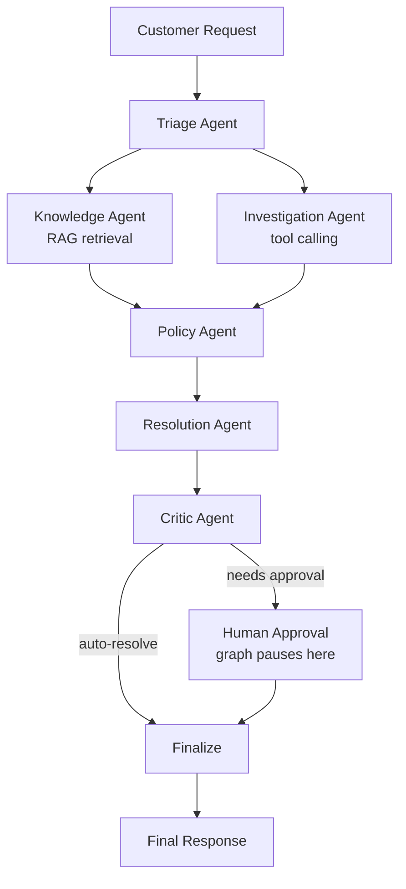

<div align="center">

# 🛡️ Aegis AI

**A stateful multi-agent customer support system that automates ticket resolution using LLM-powered triage, real-time data investigation, policy enforcement, and critic-based evaluation.**


[🚀 API Docs](http://localhost:8000/docs) · [🐛 Report Bug](../../issues)

</div>

---

## What it does

A customer sends a message like *"I was charged twice for my
subscription, please help"*. The system:

1. **Classifies** the request (intent + priority)
2. **Retrieves** relevant policy/FAQ text via RAG
3. **Investigates** the customer's real order data using tool calling
4. **Checks** which company policy applies and whether it requires approval
5. **Proposes** a concrete resolution
6. **Reviews** that resolution for hallucination risk and quality
7. **Escalates to a human** if the action is financial, risky, or the
   review score is too low — otherwise resolves automatically

Every step is grounded in real retrieved data. Nothing is decided from
the LLM's imagination alone.

---

## Architecture



**Knowledge** and **Investigation** run in parallel — they're
independent of each other, both only need the raw customer message.
**Policy** joins after both complete, since it needs the retrieved
policy text and the investigation findings to reason correctly.

The human approval step isn't a flag — it's a real pause. The graph
uses LangGraph's `interrupt()` with a checkpointer, so execution
genuinely stops and can be resumed later, from a completely separate
API request, once a human makes a decision.

---

## Why a human is looped in

The final decision to auto-resolve or escalate is an **OR** across four
independent signals — any single one is enough to require a human:

```python
needs_approval = (
    policy_check.requires_human_approval   # policy says so
    or resolution.is_sensitive_action       # refund / cancellation / irreversible
    or critic.is_hallucination_risk         # critic isn't confident it's grounded
    or critic.score < CRITIC_SCORE_THRESHOLD
)
```

This means any financial action always goes to a human for review,
regardless of amount — a deliberately conservative default for
anything touching money.

---

## Tech stack

| Layer | Tools |
|---|---|
| Agent orchestration | LangGraph, LangChain |
| LLM | Groq (Llama models) via `langchain-groq` |
| RAG | ChromaDB (local, persisted) + `sentence-transformers` embeddings |
| Structured outputs | Pydantic v2, LLM tool-calling / structured output |
| API | FastAPI |
| Config | `pydantic-settings`, `.env` |
| Containerization | Docker, Docker Compose |

Everything runs locally except the LLM calls themselves — no external
vector DB service, no paid embedding API.

---

## Project structure

```
aegis-ai/
├── src/
│   ├── agents/          # LLM logic per agent (no LangGraph knowledge here)
│   │   ├── triage_agent.py
│   │   ├── knowledge_agent.py
│   │   ├── investigation_agent.py
│   │   ├── policy_agent.py
│   │   ├── resolution_agent.py
│   │   └── critic_agent.py
│   ├── graph/
│   │   ├── state.py         # AgentState + all structured-output schemas
│   │   ├── workflow.py      # wires every node into the compiled graph
│   │   └── nodes/           # thin adapters between AgentState and agents
│   ├── prompts/         # every system prompt, versioned separately from code
│   ├── rag/
│   │   ├── vector_store.py  # Chroma + embedding setup
│   │   └── ingest.py        # loads data/faqs/*.md into the vector store
│   ├── tools/
│   │   └── order_lookup.py  # mock order/CRM lookup tool
│   ├── api/
│   │   ├── routes.py        # POST /tickets, POST /tickets/{id}/approve
│   │   └── schemas.py       # HTTP request/response contracts
│   ├── config.py
│   └── main.py           # FastAPI app entry point
├── data/
│   ├── faqs/             # source-of-truth policy/FAQ documents
│   └── chroma/           # generated vector store (not committed)
├── Dockerfile
├── docker-compose.yml
├── docker-entrypoint.sh
├── pyproject.toml
├── requirements.txt
└── .env.example
```

---

## Setup

### 🐳 Docker (recommended)

```bash
git clone https://github.com/ebrahimzaher/aegis-ai
cd aegis-ai

cp .env.example .env
# fill in GROQ_API_KEY in .env

docker compose up --build
```

The entrypoint automatically runs `python -m rag.ingest` on first start
(when no Chroma data exists), then starts the API server.

Interactive API docs: **http://localhost:8000/docs**

> **Note:** `./data/chroma` is mounted as a volume — the vector store
> persists across container restarts.

### 🐍 Local (manual)

```bash
git clone https://github.com/ebrahimzaher/aegis-ai
cd aegis-ai

python -m venv venv
venv\Scripts\activate        # Windows
# source venv/bin/activate   # macOS/Linux

pip install -r requirements.txt
pip install -e .             # makes agents/graph/config importable from anywhere

cp .env.example .env
# fill in GROQ_API_KEY in .env

python -m rag.ingest         # builds the vector store from data/faqs/

cd src
uvicorn main:app --reload
```

Interactive API docs: **http://127.0.0.1:8000/docs**

## Usage

**Open a ticket:**

```bash
curl -X POST http://127.0.0.1:8000/support/tickets \
  -H "Content-Type: application/json" \
  -d '{"customer_id": "cust_001", "message": "I was charged twice for my subscription, please help."}'
```

If the response is `"status": "pending_approval"`, the graph is paused
waiting for a human. Resume it:

```bash
curl -X POST http://127.0.0.1:8000/support/tickets/{ticket_id}/approve \
  -H "Content-Type: application/json" \
  -d '{"approved": true}'
```

You can also run the whole pipeline directly from the terminal without
the API, with an interactive approval prompt:

```bash
python -m graph.workflow
```

---

## Engineering notes

A few decisions worth calling out, since they came from real issues hit
while building this:

- **Parallel execution is real, not simulated.** LangGraph runs
  independent nodes in the same "superstep" and automatically waits
  for all of them before the next node fires — no manual
  synchronization code needed.
- **LLM boolean outputs aren't always real booleans.** Some models
  occasionally return `"True"`/`"False"` as strings inside tool calls,
  which can fail schema validation. Fields that hit this were typed as
  `Union[bool, str]` with a `field_validator` to normalize either form
  — this also relaxes the schema Groq validates against server-side,
  avoiding hard rejections.
- **Human approval is a real interrupt, not a flag.** Using
  LangGraph's `interrupt()` + a checkpointer, the graph's execution
  genuinely pauses and can be resumed by an unrelated future request,
  keyed by `thread_id` (the ticket ID).
- **Knowledge is pure retrieval, not generation.** It never calls an
  LLM — this keeps the FAQ grounding fast, cheap, and hallucination-free
  by construction.

---

## Known limitations / next steps

- `MemorySaver` is used as the checkpointer, which only persists in
  process memory — a server restart loses any ticket paused for
  approval. A production deployment should use a persistent
  checkpointer (e.g. `PostgresSaver`).
- No automated test suite yet (planned: `pytest` coverage per agent
  and for the full graph).
- No trace/evaluation dashboard yet — each run's `trace_id` is
  generated but not yet persisted or visualized.
- The mock order-lookup tool uses in-memory data; a real deployment
  would query an actual orders database/CRM.

---

## License

MIT